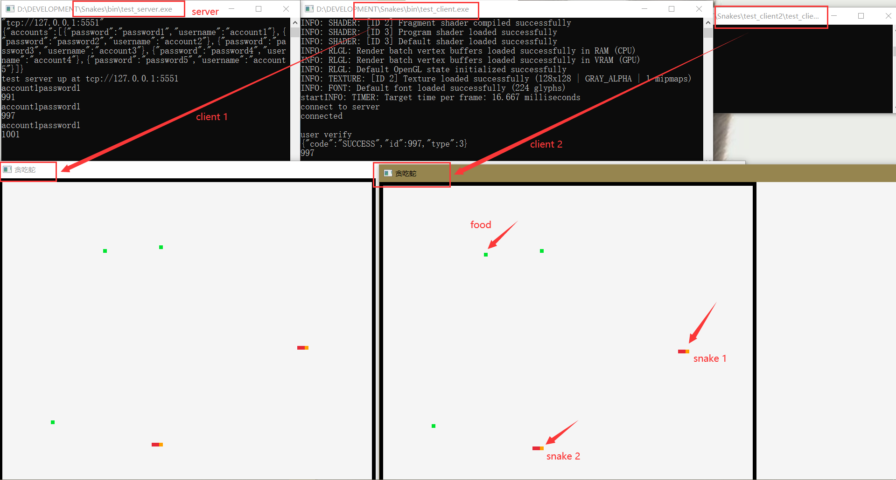

# Data-Oriented Multiplayer Snake Game Based on Flecs Framework and ZeroMQ
> This project implemented novel data-oriented multiplayer snake game based on `Flecs` framework and `ZeroMQ`. 
> code is hosted [_here_](https://github.com/userseSE/Snakes.git). <!-- If you have the project hosted somewhere, include the link here. -->

## Table of Contents
- [Data-Oriented Multiplayer Snake Game Based on Flecs Framework and ZeroMQ](#data-oriented-multiplayer-snake-game-based-on-flecs-framework-and-zeromq)
  - [Table of Contents](#table-of-contents)
  - [General Information](#general-information)
  - [Technologies Used](#technologies-used)
  - [Features](#features)
  - [Screenshots](#screenshots)
  - [Setup](#setup)
  - [Usage](#usage)
  - [ZeroMQ C/S Pattern:](#zeromq-cs-pattern)
  - [Code examples:](#code-examples)
  - [Room for Improvement](#room-for-improvement)

## General Information
- This project implemented novel data-oriented multiplayer snake game based on `Flecs` framework and `ZeroMQ`. 
- As I will study ECE in [RTXLAB](https://rtxlab000.wixsite.com/rtxlab) for MSc., I received a preentry task of making a snake game using C++ and [data-oriented programming](https://ieeexplore.ieee.org/document/10043019)
- To further improve my practical skills, I came up with the idea of combining this computer network course project with the snake game. The data-oriented architecture and technology stack were guided by an expert from RTXLAB and the detail implementation of network plugins was done by me.
<!-- You don't have to answer all the questions - just the ones relevant to your project. -->


## Technologies Used
Most thirdparty technologies and libraries are integrated as git submodules in `thirdparty` folder.
- Flecs - v3.2.3
- cppzmq - v4.9.0
- json - v3.11.2
- raylib - v4.5.0
- raylib-cpp -v4.5.0


There are some additional system dependencies installed by `vcpkg`:
- Zstd - v1.5.5
- ZeroMQ - v4.3.5
  
## Features
List the ready features here:
- Flexible Data-Oriented Entity-Component-System architecture
- Reusable unified plugin functions for single player, multiplayer server and client.
- Fully decoupled server and client implementation
- Asynchronous server communication 
- Connect the snake game with your friend in LAN
- Cross-platform compatibility
  
## Screenshots

<!-- If you have screenshots you'd like to share, include them here. -->

## Setup
Windows build instruction:
- Install Cmake, C++20-standard Compiler (recommend Clang 16), vcpkg and Ninja
- Use vcpkg to install two package Zstd and ZeroMQ:  
`./vcpkg install zstd`  
`./vcpkg install zeromq`
- Clone the repository from GitHub `git clone 'https://github.com/userseSE/Snakes.git'`
- Create a `build` file
- Initialize submodules `git submodule init && git submodule update --depth=1`
- Use Cmake to configure `cmake -G Ninja -DCMAKE_BUILD_TYPE=Release -DCMAKE_TOOLCHAIN_FILE=[path to vcpkg]/scripts/buildsystems/vcpkg.cmake`
- Use Cmake to build and install binary files `cmake --build "$BUILD_DIR" --config Release --target install  -j`


The build proccess on Linux can be found in continous integration file `Snakes/.circleci/config.yml`.

## Usage
All configuration information is in Json files, so to run the server we need to configure:
- config_server.json: the ip and port of the server which meet rules of ZMQ bind address
- key.json: the user database which stores the list of users' accounts and keys

and to run the client we need to configure:
- config_client.json: the ip and port of the server which meet rules of ZMQ bind address, so that the client can find the server.   
- clientInfo.json: the account and key of a user    

Here is a use case of the project:
- run the server first `Snakes\bin\test_server.exe`
- run one client or multiple clients, like `Snakes\bin\test_client.exe` and `Snakes\test_client2\test_client2.exe`, and play with your friends.   
  
***If you want to play the game on diffrent computers with your friends (the server and clients on different devices), you need to ensure that the devices are in the same LAN and modify the ip value as the server's ip address in `config_server.json` and all `config_client.json` files.***

Single-player game is also surported, and can be accessed by running `Snakes\bin\test_sp.exe`

## ZeroMQ C/S Pattern:   
ZeroMQ (ZMQ) is a general-purpose messaging library that provides various communication patterns including client-server, publish-subscribe, and push-pull. ZeroMQ provides client-server mode communication by implementing the ZeroMQ Message Transfer Protocol (ZMTP) on top of the TCP/IP protocol. 
1. Transport Layer Selection: ZMQ utilizes the underlying TCP/IP protocol as the foundation for message transmission. 
2. Socket Type Selection: In the client-server pattern, the server-side typically uses a ZMQ_REP (Reply) socket type, while the client-side typically uses a ZMQ_REQ (Request) socket type. These socket types define the message transport and ordering.
3. Connection Establishment: The server-side binds the socket to a specified address and port using the zmq_bind() function to listen for connection requests from clients. The client-side connects the socket to the server's address and port using the zmq_connect() function.
4. Message Exchange: The client-side sends request messages to the server-side using the zmq_send() function, and the server-side receives the request messages using the zmq_recv() function. Then, the server-side can process the request, generate a response message, and send it to the client-side using the zmq_send() function. The client-side receives the response message using the zmq_recv() function.
5. ZMTP Protocol: ZMQ utilizes the ZeroMQ Message Transfer Protocol (ZMTP) to define message encapsulation, frame structure, and other protocol details. ZMTP provides features such as frame separation, message type identification, and message security. By implementing ZMTP on top of the TCP protocol, ZMQ can handle complex tasks such as message dispatching, routing, and transport, resulting in more reliable and efficient communication.

## Code examples:
- The server utilizes an asynchronous and non-blocking approach.
```c++
void reply_commands(flecs::iter &it, ZmqServerRef *servers) {
  for (auto i = 0; i < it.count(); i++) {
    auto &server = servers[i];       
    auto &socket = server->socket(); 
    zstd buff;
    zmq::message_t message;    
    bool continue_loop = true;   
    while (continue_loop) {
      auto success = socket.recv(message, zmq::recv_flags::dontwait); 
      //non-blocking (if no message is received, an error code will be returned, rather than hang-up to wait the message)
      if (success.has_value()) { 

        auto decompressed_data = buff.decompress(message.to_string_view());
        auto msg_json = json::parse(decompressed_data);
        auto reply = handle_message(msg_json, it); 
        auto rmsg = reply.dump();
        auto compressed_data = buff.compress(rmsg, 3);
        zmq::message_t reply_msg{compressed_data};

        socket.send(reply_msg, zmq::send_flags::none); 
      } else {
        continue_loop = false; 
        //asynchronuous (whether or not a message is received, the function will return and will not block the thread)
      }
    }
  }
}
```
- The client utilizes a synchronuous and blocking approach.
```c++
void control_cmd(flecs::iter &it) { 
//synchronuous (the code executes sequentially, the function will return only when all operations are executed.)
  auto controller = it.world().get<SnakeController>();
  auto directions = it.world().get<Direction>();

  auto &client = *it.world().get_mut<ZmqClientRef>(); 
  json cmd;
  cmd["type"] = CONTROL;
  cmd["id"] = controller[0].player_id;
  cmd["cmd"] = directions[0];

  zstd buff;
  auto msg_data = buff.compress(cmd.dump(), 3);
  zmq::message_t msg{msg_data};    
  auto &socket = client->socket(); 
  socket.send(msg, zmq::send_flags::none); 
  auto recv = socket.recv(msg, zmq::recv_flags::none);  
  //blocking (if no message, the thread will hang-out to wait the reply message)
}
```
***The generation of plugin (function->system->build)***
- Server plugin: 
1. the following four systems, which are concerned with interations and message deliveries with the client, are created in server's plugin.
```c++
void ZmqServerPlugin::build(flecs::world &world) {
  auto sys = init_ip_system(world).depends_on(flecs::OnStart);
  // Create a system that initializes the IP address and specify that it runs in the flecs::OnStart phase.
  init_user_system(world).depends_on(flecs::OnStart);
  // Create a system that initializes user's database and specify that it runs in the flecs::OnStart phase.
  init_zmq_server_system(world).depends_on(sys);
  // Create a system that initializes ZMQ server, and specify that it runs in the flecs::OnStart phase and depends on the system that initializes IP address.
  reply_commands_system(world).depends_on(flecs::PreUpdate);
  // Create a system that receives messages and sends replies, and specify that it runs in the flecs::PreUpdate phase.
}
```
2. Then, in the main function of server, an object of `ZmqServerPlugin` is created, and its `build` operation is called to add it to the flecs world.
```c++
ZmqServerPlugin server;
server.build(ecs);
```
3. Apart from those systems in `ZmqServerPlugin`, some general plugins concerning the logic of the snake game are created in the main function to complete the generation and calculation of the game graph.
```c++
OccupiedTilePlugin p1;
auto system =
      ecs.system<TilePos, TileType, const TileSize>().term_at(3).parent().iter(
          init_color); // init color
IntoSystemBuilder builder(init_snake_bodies);   // init snake
IntoSystemBuilder builder2(init_snake_graphic); // init snake graphic
IntoSystemBuilder move_snake_system(move_snake);  // move snake
IntoSystemBuilder update_render_snake_system(update_render_snake);  // update and render
auto spawn_food = spawn_food_system(ecs); // spawn food
auto map_food = food_to_map_system(ecs);  // map food
spawn_food.depends_on(flecs::PostUpdate); // spawn food depends on postupdate
map_food.depends_on(spawn_food);        // map food depends on spawn food
p1.build(ecs);                          // build occupied tile plugin
```
- Client plugin: 
1. In the main function, an object of `ZmqClientPlugin` is created to encapsulate functions of the client.
2. Then, the `build` method of the object is called to build a client, which creates two systems encapsulated in `ZmqClientPlugin` function, `init_zmq_client_system` and `user_verify_system` depending on `flecs::OnStart` event, in the main function. That means they can only be called for once at the start time of the ECS world.
3. In the function of `ZmqClientPlugin`, two other systems `system1 - control_cmd` and `system2 - graph_show`, which can be called multiple times, are created and constructed using `IntoSystemBuilder`, the system builder tool provided by Flecs.
4. Next, in the main function, the `ecs.set<ZmqClientRef>` method is called to set a `ZmqClientRef` component that stores a smart pointer to the ZmqClient object, which allows us to use the `ecs.get_mut<ZmqClientRef>` method in other systems to get this pointer and operate on the ZMQ client.

```c++
int main(int argc, char *argv[]) {
  flecs::world ecs;
  ZmqClientPlugin client;
  client.build(ecs);
  // build plugin
  ecs.set<ZmqClientRef>(ZmqClientRef{std::make_shared<ZmqClient>(2)});
  // create a shared pointer to the ZmqClient object
  ... other code...
}
```
```c++
void ZmqClientPlugin::build(flecs::world &world) {
  init_zmq_client_system(world).depends_on(flecs::OnStart);
  // Create the init_zmq_client_system system to initialize a zmq client and make it depend on flecs::OnStart event
  user_verify_system(world).depends_on(flecs::OnStart);
  IntoSystemBuilder system(control_cmd);
  // Create an IntoSystemBuilder object for control_cmd system, which perform the function of sending control command to the server and recieving the reply
  IntoSystemBuilder system2(graph_show);

  system.build(world);
  // Build the control_cmd system
  system2.build(world);
}
```
## Room for Improvement

Room for improvement:
- An asynchronuous and non-blocking method can be used for the client: Observe lag can be observed in the clients during the game, which mostly due to the utilization of synchronuous and blocking method.
- Only changes should be delivered by the server, rather than all tiles of the graph are sent in every time of communication, which would improve the efficiency of the game. 

To do:
- To do collision detections between snakes and walls, and events after collision.
- To do a log in function and the concerned web page, as user database and user information of the clients are accessed in json files now.

